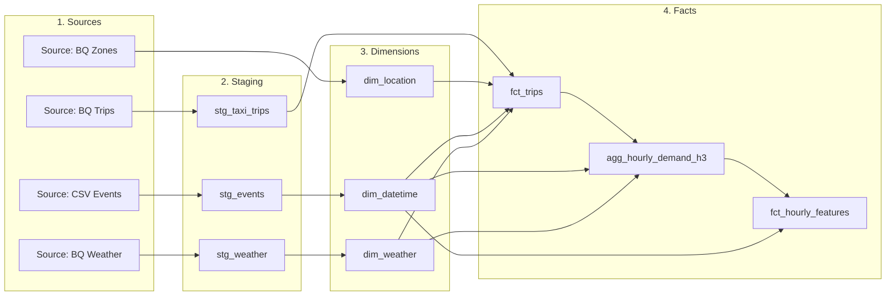

# Data Warehouse Schema Summary

## Giới thiệu

Tài liệu này cung cấp một cái nhìn tổng quan chi tiết về tất cả các bảng (tables) và view trong kho dữ liệu của dự án. Kho dữ liệu được xây dựng theo kiến trúc 3 lớp kinh điển: **Staging**, **Dimensions**, và **Facts**.

---

## Lớp 1: Staging Layer
Lớp này đóng vai trò là khu vực trung gian, nơi dữ liệu thô từ các nguồn bên ngoài được làm sạch, ép kiểu và chuẩn hóa tên cột. Các mô hình trong lớp này thường được vật lý hóa (materialized) dưới dạng **view** để đảm bảo tính linh hoạt và không tốn thêm chi phí lưu trữ.

### `stg_events`
- **Mô tả:** Chuẩn hóa dữ liệu từ file `events_calendar.csv`, chứa thông tin về các ngày lễ và sự kiện đặc biệt trong năm.
- **Nguồn:** `seeds/events_calendar.csv`

| Tên Thuộc tính | Kiểu Dữ liệu | Mô tả |
| :--- | :--- | :--- |
| `event_date` | `DATE` | Ngày diễn ra sự kiện. |
| `event_name` | `STRING` | Tên của sự kiện (ví dụ: "New Year's Day"). |
| `event_type` | `STRING` | Loại sự kiện (ví dụ: "Public Holiday"). |

### `stg_taxi_trips`
- **Mô tả:** Làm sạch và chuẩn hóa dữ liệu gốc về các chuyến taxi vàng. Các bước xử lý chính bao gồm ép kiểu dữ liệu, đổi tên cột cho dễ hiểu, và lọc bỏ các bản ghi không hợp lệ (ví dụ: chuyến đi có khoảng cách bằng 0, không có ID địa điểm, hoặc dữ liệu nằm ngoài phạm vi thời gian phân tích).
- **Nguồn:** `bigquery-public-data.new_york_taxi_trips.tlc_yellow_trips_2021`

| Tên Thuộc tính | Kiểu Dữ liệu | Mô tả |
| :--- | :--- | :--- |
| `vendor_id` | `STRING` | ID của nhà cung cấp dịch vụ taxi. |
| `picked_up_at` | `TIMESTAMP` | Thời điểm khách được đón. |
| `dropped_off_at` | `TIMESTAMP` | Thời điểm khách được trả. |
| `passenger_count` | `INT64` | Số lượng hành khách trên chuyến đi. |
| `trip_distance` | `NUMERIC` | Khoảng cách của chuyến đi (tính bằng dặm). |
| `pickup_location_id` | `STRING` | ID của khu vực đón khách (tham chiếu đến bảng `taxi_zone_lookup`). |
| `dropoff_location_id` | `STRING` | ID của khu vực trả khách (tham chiếu đến bảng `taxi_zone_lookup`). |
| `rate_code_id` | `STRING` | ID của loại giá cước (ví dụ: giá tiêu chuẩn, giá đi sân bay). |
| `payment_type_id` | `STRING` | ID của phương thức thanh toán (ví dụ: thẻ tín dụng, tiền mặt). |
| `fare_amount` | `NUMERIC` | Giá cước cơ bản của chuyến đi. |
| `extra_amount` | `NUMERIC` | Phụ phí (ví dụ: phụ phí giờ cao điểm). |
| `mta_tax` | `NUMERIC` | Thuế MTA. |
| `tip_amount` | `NUMERIC` | Tiền boa của khách hàng. |
| `tolls_amount` | `NUMERIC` | Phí cầu đường. |
| `improvement_surcharge` | `NUMERIC` | Phụ phí cải thiện cơ sở hạ tầng. |
| `airport_fee` | `NUMERIC` | Phí sân bay. |
| `total_amount` | `NUMERIC` | Tổng số tiền khách hàng phải trả. |

### `stg_weather`
- **Mô tả:** Làm sạch và chuẩn hóa dữ liệu thời tiết từ NOAA. Lớp này chỉ lọc lấy dữ liệu từ các trạm quan trắc chính quanh khu vực NYC và ép kiểu dữ liệu cho phù hợp.
- **Nguồn:** `bigquery-public-data.noaa_gsod.gsod2021`

| Tên Thuộc tính | Kiểu Dữ liệu | Mô tả |
| :--- | :--- | :--- |
| `station_id` | `STRING` | ID của trạm quan trắc thời tiết. |
| `observation_date` | `DATE` | Ngày quan trắc. |
| `avg_temp_f` | `NUMERIC` | Nhiệt độ trung bình trong ngày (độ F). |
| `max_temp_f` | `NUMERIC` | Nhiệt độ cao nhất trong ngày (độ F). |
| `min_temp_f` | `NUMERIC` | Nhiệt độ thấp nhất trong ngày (độ F). |
| `precipitation_inches` | `NUMERIC` | Lượng mưa trong ngày (inches). |
| `is_foggy` | `BOOLEAN` | Cờ báo hiệu có sương mù hay không. |
| `is_rainy` | `BOOLEAN` | Cờ báo hiệu có mưa hay không. |
| `is_snowy` | `BOOLEAN` | Cờ báo hiệu có tuyết hay không. |

---

## Lớp 2: Marts - Bảng Chiều (Dimension Tables)
Lớp này chứa các bảng mô tả chi tiết về các đối tượng trong hệ thống, cung cấp ngữ cảnh cho các bảng sự kiện (Fact tables).

### `dim_datetime`
- **Mô tả:** Bảng chiều thời gian, được tạo ra để cung cấp các thuộc tính thời gian chi tiết cho mỗi ngày trong năm. Bảng này được làm giàu với thông tin về các ngày lễ, sự kiện.
- **Nguồn:** `stg_events`

| Tên Thuộc tính | Kiểu Dữ liệu | Mô tả |
| :--- | :--- | :--- |
| `date_id` | `STRING` | Khóa chính của bảng (định dạng YYYYMMDD, ví dụ: "20210131"). |
| `full_date` | `DATE` | Ngày đầy đủ (ví dụ: 2021-01-31). |
| `year` | `INT64` | Năm. |
| `month` | `INT64` | Tháng. |
| `day` | `INT64` | Ngày. |
| `day_of_week` | `INT64` | Thứ trong tuần (1=Chủ Nhật, 7=Thứ Bảy). |
| `day_of_year` | `INT64` | Ngày thứ bao nhiêu trong năm. |
| `quarter` | `INT64` | Quý trong năm. |
| `is_weekend` | `BOOLEAN` | Cờ báo hiệu ngày cuối tuần. |
| `event_name` | `STRING` | Tên sự kiện nếu có. |
| `event_type` | `STRING` | Loại sự kiện nếu có. |
| `is_holiday` | `BOOLEAN` | Cờ báo hiệu ngày lễ. |

### `dim_location`
- **Mô tả:** Bảng chiều địa lý, chuyển đổi các ID khu vực taxi thành các thông tin không gian hữu ích như tên quận, tọa độ trung tâm, và đặc biệt là **H3 ID** để phục vụ cho phân tích không gian.
- **Nguồn:** `bigquery-public-data.new_york_taxi_trips.taxi_zone_geom`

| Tên Thuộc tính | Kiểu Dữ liệu | Mô tả |
| :--- | :--- | :--- |
| `zone_id` | `STRING` | Khóa chính, ID của khu vực taxi. |
| `zone_name` | `STRING` | Tên của khu vực (ví dụ: "JFK Airport"). |
| `borough` | `STRING` | Tên quận (ví dụ: "Queens"). |
| `zone_centroid` | `GEOGRAPHY` | Tọa độ điểm trung tâm của khu vực. |
| `h3_centroid_longitude` | `FLOAT64` | Kinh độ của điểm trung tâm. |
| `h3_centroid_latitude` | `FLOAT64` | Vĩ độ của điểm trung tâm. |
| `h3_id` | `STRING` | ID của ô lưới H3 (độ phân giải 8) chứa điểm trung tâm của khu vực. |

### `dim_weather`
- **Mô tả:** Bảng chiều thời tiết, tổng hợp dữ liệu thời tiết theo từng ngày. Bảng này chuyển đổi đơn vị (từ F sang C, từ inches sang mm) và tạo các cờ báo hiệu thời tiết cực đoan.
- **Nguồn:** `stg_weather`

| Tên Thuộc tính | Kiểu Dữ liệu | Mô tả |
| :--- | :--- | :--- |
| `weather_date` | `DATE` | Khóa chính, ngày quan trắc thời tiết. |
| `avg_temp_celsius` | `FLOAT64` | Nhiệt độ trung bình trong ngày (độ C). |
| `max_temp_celsius` | `FLOAT64` | Nhiệt độ cao nhất trong ngày (độ C). |
| `min_temp_celsius` | `FLOAT64` | Nhiệt độ thấp nhất trong ngày (độ C). |
| `total_precipitation_mm` | `FLOAT64` | Tổng lượng mưa trong ngày (mm). |
| `had_rain` | `BOOLEAN` | Cờ báo hiệu ngày đó có mưa. |
| `had_snow` | `BOOLEAN` | Cờ báo hiệu ngày đó có tuyết. |
| `had_fog` | `BOOLEAN` | Cờ báo hiệu ngày đó có sương mù. |

---

## Lớp 3: Marts - Bảng Sự kiện (Fact Tables)
Lớp này chứa các bảng ghi lại các sự kiện kinh doanh và các số liệu đo lường, được xây dựng dựa trên mô hình star schema hoặc snowflake schema.

### `fct_trips`
- **Mô tả:** Bảng fact trung tâm, chứa thông tin chi tiết về từng chuyến đi. Mỗi hàng đại diện cho một chuyến đi và được làm giàu bằng cách join với các bảng chiều (`dim_datetime`, `dim_location`, `dim_weather`) để lấy ngữ cảnh.
- **Nguồn:** `stg_taxi_trips`, `dim_datetime`, `dim_location`, `dim_weather`

| Tên Thuộc tính | Kiểu Dữ liệu | Mô tả |
| :--- | :--- | :--- |
| `trip_id` | `STRING` | Khóa chính thay thế (surrogate key) được tạo ra cho mỗi chuyến đi. |
| `vendor_id` | `STRING` | ID của nhà cung cấp. |
| `payment_type_id` | `STRING` | ID của phương thức thanh toán. |
| `rate_code_id` | `STRING` | ID của loại giá cước. |
| `datetime_id` | `STRING` | Khóa ngoại, tham chiếu đến `dim_datetime.date_id`. |
| `pickup_h3_id` | `STRING` | Khóa ngoại, H3 ID của địa điểm đón, tham chiếu đến `dim_location.h3_id`. |
| `dropoff_h3_id` | `STRING` | Khóa ngoại, H3 ID của địa điểm trả, tham chiếu đến `dim_location.h3_id`. |
| `weather_date` | `DATE` | Khóa ngoại, tham chiếu đến `dim_weather.weather_date`. |
| `picked_up_at` | `TIMESTAMP` | Thời điểm đón khách. |
| `dropped_off_at` | `TIMESTAMP` | Thời điểm trả khách. |
| `passenger_count` | `INT64` | Số lượng hành khách. |
| `trip_distance` | `NUMERIC` | Khoảng cách chuyến đi (dặm). |
| `trip_duration_seconds` | `INT64` | Thời gian chuyến đi (giây). |
| `fare_amount` | `NUMERIC` | Giá cước cơ bản. |
| `total_amount` | `NUMERIC` | Tổng số tiền. |
| ... | `NUMERIC` | Các cột khác về chi phí (tip, tax, tolls...). |

### `agg_hourly_demand_h3`
- **Mô tả:** Bảng tổng hợp được xây dựng cho mục đích Machine Learning. Bảng này tổng hợp số lượng chuyến đi theo từng giờ và từng khu vực H3, đồng thời đính kèm các đặc trưng (features) về thời gian và thời tiết tại thời điểm đó.
- **Nguồn:** `fct_trips`, `dim_datetime`, `dim_weather`

| Tên Thuộc tính | Kiểu Dữ liệu | Mô tả |
| :--- | :--- | :--- |
| `pickup_h3_id` | `STRING` | ID của khu vực H3. |
| `timestamp_hour` | `TIMESTAMP` | Mốc thời gian theo giờ. |
| `total_pickups` | `INT64` | **Biến mục tiêu (Target Variable)**. Tổng số chuyến đi được đón trong giờ đó tại khu vực đó. |
| `is_weekend` | `BOOLEAN` | Là ngày cuối tuần? |
| `is_holiday` | `BOOLEAN` | Là ngày lễ? |
| `day_of_week` | `INT64` | Thứ trong tuần. |
| `hour_of_day` | `INT64` | Giờ trong ngày. |
| `avg_temp_celsius` | `FLOAT64` | Nhiệt độ trung bình. |
| `total_precipitation_mm` | `FLOAT64` | Tổng lượng mưa. |
| `had_rain` | `BOOLEAN` | Có mưa? |
| `had_snow` | `BOOLEAN` | Có tuyết? |

### `fct_hourly_features`
- **Mô tả:** Bảng features cuối cùng, được thiết kế chuyên sâu cho mô hình dự báo chuỗi thời gian (Time Series). Bảng này xây dựng các features phức tạp hơn như features trễ (lag features) và trung bình trượt (rolling averages) để giúp mô hình nhận diện các xu hướng và quy luật trong quá khứ.
- **Nguồn:** `agg_hourly_demand_h3`, `dim_datetime`

| Tên Thuộc tính | Kiểu Dữ liệu | Mô tả |
| :--- | :--- | :--- |
| `total_pickups` | `INT64` | Biến mục tiêu. |
| `pickup_h3_id` | `STRING` | ID khu vực H3. |
| `timestamp_hour` | `TIMESTAMP` | Mốc thời gian theo giờ. |
| `hour_of_day`, `day_of_week`, `month`... | `INT64` | Các features về thời gian. |
| `avg_temp_celsius`, `had_rain`... | `FLOAT64`/`BOOLEAN` | Các features về thời tiết. |
| `pickups_1h_ago` | `INT64` | Feature trễ: số chuyến đi 1 giờ trước. |
| `pickups_24h_ago` | `INT64` | Feature trễ: số chuyến đi 24 giờ trước. |
| `pickups_1week_ago` | `INT64` | Feature trễ: số chuyến đi 1 tuần trước. |
| `avg_pickups_7h` | `FLOAT64` | Trung bình trượt: trung bình số chuyến đi trong 7 giờ qua. |
| `avg_pickups_24h` | `FLOAT64` | Trung bình trượt: trung bình số chuyến đi trong 24 giờ qua. |
| `pickups_change_24h` | `INT64` | Feature xu hướng: sự thay đổi số chuyến đi so với 24 giờ trước. |
| `rain_during_rush_hour` | `INT64` | Feature tương tác: cờ báo hiệu trời mưa trong giờ cao điểm. |

---

## Sơ đồ Quan hệ (Schema Relationship Diagram)
Dưới đây là sơ đồ mô tả luồng dữ liệu và mối quan hệ giữa các bảng và view trong kho dữ liệu.

