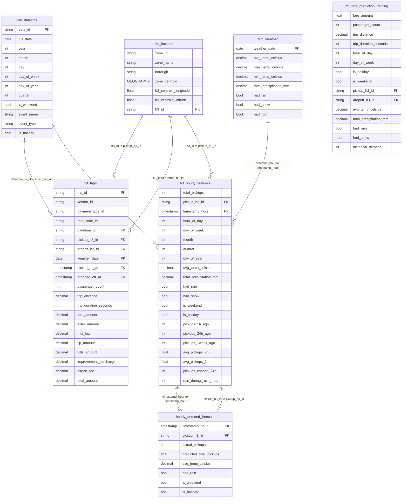

# NYC Taxi Data Warehouse - Entity Relationship Diagram

This diagram shows the relationships between tables in the data warehouse.

## Star Schema Architecture

- **Fact Tables**: `fct_trips`, `fct_hourly_features`, `fct_fare_prediction_training`
- **Dimension Tables**: `dim_datetime`, `dim_location`, `dim_weather`
- **ML Predictions**: `hourly_demand_forecast`

