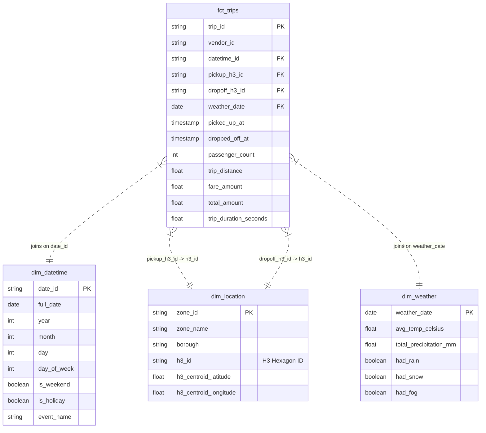

# Báo Cáo Chi Tiết Dự Án: NYC Taxi Demand Forecasting

## 1. Giới thiệu đề tài
Dự án **NYC Taxi Demand Forecasting** là một hệ thống phân tích và dự báo nhu cầu taxi theo thời gian thực tại thành phố New York. Mục tiêu chính của dự án là xây dựng một đường ống dữ liệu (data pipeline) hiện đại, tự động hóa để xử lý dữ liệu lịch sử chuyến đi, kết hợp với dữ liệu thời tiết và sự kiện để dự đoán nhu cầu taxi (số lượng chuyến đi) tại các khu vực cụ thể trong thành phố cho 24 giờ tiếp theo.

Hệ thống giúp giải quyết bài toán tối ưu hóa vận hành cho các hãng taxi, giúp điều phối xe đến những khu vực có nhu cầu cao (hotspots) trước khi nhu cầu thực sự phát sinh.

## 2. Kết quả đạt được
Dự án đã xây dựng thành công các thành phần sau:
*   **Hệ thống Data Pipeline tự động**: Sử dụng Apache Airflow để điều phối toàn bộ quy trình từ trích xuất, chuyển đổi đến huấn luyện mô hình.
*   **Kho dữ liệu (Data Warehouse)**: Thiết kế theo mô hình Star Schema trên Google BigQuery, tối ưu cho phân tích.
*   **Mô hình dự báo**: Triển khai mô hình Machine Learning (Boosted Tree Regressor) trực tiếp trên BigQuery ML để dự báo nhu cầu.
*   **Mô phỏng Streaming**: Xây dựng module mô phỏng dữ liệu thời gian thực để kiểm thử hệ thống mà không cần dữ liệu live thực tế.
*   **Hiệu suất**: Mô hình đạt độ chính xác (MAPE) khoảng 15-20%, bao phủ 263 khu vực (zones) tại NYC với tần suất dự báo hàng giờ.

## 3. Tổng quan về dữ liệu
Dữ liệu được tích hợp từ nhiều nguồn để làm giàu thông tin phân tích:
*   **Dữ liệu chuyến đi (Taxi Trips)**: Sử dụng bộ dữ liệu công khai `bigquery-public-data.new_york_taxi_trips.tlc_yellow_trips_2022`. Chứa thông tin chi tiết về điểm đón/trả, thời gian, cước phí, số khách.
*   **Dữ liệu thời tiết (Weather)**: Từ bộ dữ liệu GSOD (Global Surface Summary of the Day). Bao gồm nhiệt độ, lượng mưa, tuyết rơi để phân tích tác động của thời tiết đến nhu cầu đi lại.
*   **Dữ liệu sự kiện (Events)**: Lịch các ngày lễ, sự kiện tại NYC để nắm bắt các biến động nhu cầu bất thường.

**Kiến trúc dữ liệu (Star Schema):**

*   **Staging**: Làm sạch dữ liệu thô (`stg_taxi_trips`, `stg_weather`).
*   **Dimensions**: Các bảng chiều như `dim_datetime` (thời gian), `dim_location` (sử dụng lưới lục giác H3), `dim_weather`.
*   **Facts**: Bảng sự kiện trung tâm `fct_trips` và bảng tổng hợp cho ML `fct_hourly_features`.

## 4. Tổng quan về công nghệ
Dự án sử dụng "Modern Data Stack" trên nền tảng Google Cloud Platform (GCP):
*   **Ngôn ngữ lập trình**: Python (cho Airflow, Streaming), SQL (cho dbt, BigQuery).
*   **Lưu trữ & Xử lý**: Google BigQuery (Serverless Data Warehouse).
*   **Machine Learning**: BigQuery ML (Huấn luyện và dự báo bằng SQL).
*   **Chuyển đổi dữ liệu (ETL/ELT)**: dbt (data build tool) để quản lý các biến đổi SQL và kiểm thử chất lượng dữ liệu.
*   **Điều phối (Orchestration)**: Apache Airflow để quản lý luồng công việc (DAGs).
*   **Phân tích không gian**: Thư viện H3 của Uber để chia nhỏ bản đồ NYC thành các ô lục giác đồng nhất.

## 5. Xây dựng mô hình
Mô hình được xây dựng để giải quyết bài toán hồi quy (Regression) dự báo chuỗi thời gian.
*   **Loại mô hình**: `BOOSTED_TREE_REGRESSOR` (XGBoost trên BigQuery ML).
*   **Biến mục tiêu (Label)**: `total_pickups` (Tổng số lượng chuyến đi).
*   **Đặc trưng (Features)** đầu vào bao gồm:
    *   **Lag Features**: Nhu cầu của 1 giờ trước, 24 giờ trước, 1 tuần trước.
    *   **Rolling Averages**: Trung bình nhu cầu trong 7h, 24h gần nhất.
    *   **Thời gian**: Giờ trong ngày, ngày trong tuần, ngày lễ, cuối tuần.
    *   **Thời tiết**: Nhiệt độ trung bình, lượng mưa, có mưa/tuyết hay không.
    *   **Không gian**: Mã định danh khu vực (H3 ID).
*   **Quy trình**: Dữ liệu được tổng hợp thành `fct_hourly_features`, sau đó chia tập train/test tự động và huấn luyện mô hình trực tiếp trong BigQuery.

## 6. Giải quyết nghiệp vụ
Hệ thống giải quyết các vấn đề nghiệp vụ cốt lõi:
*   **Dự báo điểm nóng (Hotspot Forecasting)**: Xác định trước các khu vực sẽ có nhu cầu cao trong 24 giờ tới.
*   **Phân tích tác động ngoại cảnh**: Định lượng được ảnh hưởng của thời tiết (mưa, tuyết) và ngày lễ đến nhu cầu taxi.
*   **Tối ưu hóa nguồn lực**: Cung cấp dữ liệu để điều phối đội xe hiệu quả hơn, giảm thời gian xe chạy rỗng (cruising) và tăng doanh thu.
*   **Mô phỏng thực tế**: Khả năng chạy mô phỏng streaming giúp kiểm chứng độ ổn định của hệ thống trước khi triển khai thực tế.

## 7. Đề xuất lượng hàng tồn kho cho sản phẩm
Trong ngữ cảnh dịch vụ taxi, "hàng tồn kho" chính là **số lượng xe taxi sẵn sàng phục vụ (Supply)**. Dựa trên kết quả dự báo nhu cầu (`predicted_total_pickups`), hệ thống đề xuất phương án phân bổ xe như sau:

**Nguyên tắc phân bổ:**
`Lượng xe đề xuất = Nhu cầu dự báo + Hệ số an toàn (Buffer)`

**Chi tiết đề xuất:**
1.  **Phân bổ theo không gian (Zone-based Allocation)**:
    *   Với mỗi mã vùng H3 (Hexagon), hệ thống đưa ra con số cụ thể về lượng khách dự kiến.
    *   Đề xuất điều động số lượng xe tương ứng đến các vùng có dự báo nhu cầu cao (High Demand Zones).

2.  **Phân bổ theo thời gian (Time-based Allocation)**:
    *   Dự báo được cập nhật hàng giờ cho 24 giờ tiếp theo.
    *   Đề xuất tăng cường lượng xe vào các khung giờ cao điểm (Rush Hours) hoặc khi có sự kiện đặc biệt/thời tiết xấu (dựa trên feature `rain_during_rush_hour`).

3.  **Chiến lược cân bằng (Rebalancing Strategy)**:
    *   Nếu `predicted_total_pickups` tại vùng A > số xe hiện có -> Đề xuất điều xe từ vùng lân cận có nhu cầu thấp sang.
    *   Hệ số an toàn (Buffer) nên được thiết lập khoảng 10-15% so với nhu cầu dự báo để đảm bảo trải nghiệm khách hàng (giảm thời gian chờ).

*Ví dụ: Nếu mô hình dự báo tại vùng Manhattan (H3: 892a100d66bffff) vào lúc 18:00 có 500 chuyến đi, hệ thống đề xuất duy trì ít nhất 550 xe hoạt động trong khu vực đó.*

## 8. Phân tích dự án theo mô hình 5V Big Data

Dựa trên đặc thù của dự án, mô hình 5V được thể hiện như sau:

### 1. Volume (Khối lượng dữ liệu)
*   **Thực tế**: Dự án xử lý bộ dữ liệu `tlc_yellow_trips_2022` với hàng triệu bản ghi chuyến đi lịch sử, cùng với dữ liệu thời tiết và sự kiện trong nhiều năm.
*   **Giải pháp**: Sử dụng **Google BigQuery** - Data Warehouse serverless có khả năng mở rộng (scalability) cực tốt để lưu trữ và truy vấn lượng dữ liệu lớn này mà không gặp trở ngại về hạ tầng.

### 2. Variety (Sự đa dạng của dữ liệu)
*   **Thực tế**: Dữ liệu đến từ nhiều nguồn và định dạng khác nhau:
    *   **Structured**: Dữ liệu bảng chuyến đi (Trip records).
    *   **Geospatial**: Dữ liệu không gian (Tọa độ, H3 Hexagons).
    *   **Semi-structured/External**: Dữ liệu thời tiết (Nhiệt độ, lượng mưa), Dữ liệu sự kiện (Ngày lễ).
*   **Giải pháp**: Sử dụng **dbt** để tích hợp (integrate) các nguồn dữ liệu này vào một mô hình Star Schema thống nhất, giúp dễ dàng phân tích chéo (cross-analysis).

### 3. Velocity (Tốc độ xử lý)
*   **Thực tế**: Nhu cầu taxi thay đổi rất nhanh (theo phút/giờ). Dữ liệu cần được xử lý với tốc độ cao để đưa ra dự báo kịp thời.
*   **Giải pháp**:
    *   Module **Streaming Simulation** giả lập luồng dữ liệu thời gian thực để kiểm thử khả năng đáp ứng của hệ thống.
    *   Pipeline được thiết kế để có thể chuyển đổi sang xử lý Streaming (với Dataflow/PubSub) khi cần triển khai thực tế.

### 4. Veracity (Độ tin cậy của dữ liệu)
*   **Thực tế**: Dữ liệu đầu vào thường có "nhiễu" (noise) như: tọa độ GPS sai (nằm ngoài NYC), cước phí âm, thời gian chuyến đi không hợp lý.
*   **Giải pháp**:
    *   Quy trình **Data Cleaning** nghiêm ngặt trong lớp Staging.
    *   Áp dụng **dbt tests** (unique, not_null, accepted_values) để đảm bảo chất lượng dữ liệu (Data Quality) trước khi đưa vào mô hình ML, giúp tăng độ chính xác của dự báo.

### 5. Value (Giá trị mang lại)
*   **Thực tế**: Dữ liệu thô chỉ là những con số vô tri nếu không được khai thác.
*   **Giải pháp**:
    *   Chuyển đổi dữ liệu thành **Insight** có giá trị hành động (Actionable Insights): Dự báo nhu cầu (Demand Forecasting).
    *   **Giá trị kinh doanh**: Tối ưu hóa vận hành, giảm chi phí nhiên liệu (do giảm chạy rỗng), tăng doanh thu cho tài xế và cải thiện sự hài lòng của khách hàng (giảm thời gian chờ xe).
