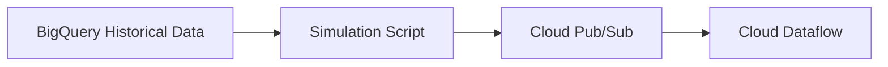

# 🚕 Streaming Data Simulation

Thư mục này chứa các script để simulate streaming data từ BigQuery public dataset thay vì sử dụng real mobile apps và taxi meters.

## 📋 Overview

Thay vì cần real mobile apps và taxi meters, chúng ta sẽ:
1. **Extract** historical data từ BigQuery public dataset
2. **Transform** thành real-time events
3. **Stream** vào Pub/Sub với realistic timing
4. **Monitor** streaming data real-time

## 🔧 Setup

### 1. Install Dependencies
```bash
cd streaming_simulation
pip install -r requirements.txt
```

### 2. Setup Google Cloud Authentication
```bash
# Set up authentication
gcloud auth application-default login

# Set project ID
gcloud config set project nyc-taxi-project-477115
```

### 3. Create Infrastructure
```bash
# Run setup script to create Pub/Sub topics and BigQuery tables
python setup_streaming.py
```

## 🚀 Usage

### 1. Start Streaming Simulation
```bash
# Terminal 1: Start data simulation
python simulate_realtime_taxi_data.py
```

### 2. Monitor Streaming Data
```bash
# Terminal 2: Monitor live events  
python monitor_stream.py
```

### 3. Sample Output

**Simulation Output:**
```
🚕 Starting taxi data simulation:
   📅 Date: 2023-01-15
   🚗 Trips: 500
   ⚡ Speed: 30.0x real-time
   📡 Topic: taxi-events
   🏗️ Project: nyc-taxi-project-477115

Processed 50/500 trips
Processed 100/500 trips
✅ Simulation completed successfully!
```

**Monitor Output:**
```
============================================================
🚕 NYC TAXI STREAMING MONITOR
============================================================
⏰ Uptime: 0:05:23
📊 Total Events: 1,250
⚡ Rate: 3.85 events/second
🚗 Active Trips: 42

📈 Event Breakdown:
   trip_start: 625 (50.0%)
   trip_end: 583 (46.6%)
   weather_update: 42 (3.4%)

🛣️ Average Trip Distance: 2.45 miles
💰 Average Fare: $12.85
🏙️ Manhattan Pickups (last 50): 38
============================================================
```

## 📁 Files

- **`simulate_realtime_taxi_data.py`**: Main simulation script
- **`setup_streaming.py`**: Infrastructure setup
- **`monitor_stream.py`**: Real-time monitoring
- **`requirements.txt`**: Python dependencies

## ⚙️ Configuration

### Simulation Parameters
```python
# In simulate_realtime_taxi_data.py
PROJECT_ID = "nyc-taxi-project-477115"
TOPIC_NAME = "taxi-events"
SIMULATION_DATE = "2023-01-15"        # Historical date to simulate
NUM_TRIPS = 500                       # Number of trips to simulate
SPEED_MULTIPLIER = 30.0               # How much faster than real-time
```

### Event Types Generated

**Trip Start Event:**
```json
{
  "event_type": "trip_start",
  "trip_id": "uuid-here",
  "driver_id": "driver_1234",
  "vehicle_id": "taxi_1_567",
  "pickup_location": {"lat": 40.7589, "lng": -73.9851},
  "pickup_time": "2025-11-10T14:30:00",
  "passenger_count": 2,
  "estimated_fare": 15.50,
  "payment_type": "credit_card",
  "timestamp": "2025-11-10T14:30:00",
  "source": "simulation"
}
```

**Trip End Event:**
```json
{
  "event_type": "trip_end",
  "trip_id": "uuid-here",
  "dropoff_location": {"lat": 40.7505, "lng": -73.9934},
  "dropoff_time": "2025-11-10T14:45:00",
  "final_fare": 18.75,
  "tip_amount": 3.50,
  "total_amount": 22.25,
  "trip_distance": 2.1,
  "trip_duration_minutes": 15.0,
  "timestamp": "2025-11-10T14:45:00",
  "source": "simulation"
}
```

## 🔗 Integration with Architecture

Các scripts này replace phần này trong architecture:



Thay vì:
```
Mobile Apps → Pub/Sub
Taxi Meters → Pub/Sub  
```

Chúng ta có:
```
Historical Data → Simulation Script → Pub/Sub → Dataflow
```

## 🧪 Testing

### Test Pub/Sub Connection
```bash
python -c "
from setup_streaming import test_pubsub_connection
test_pubsub_connection()
"
```

### Test BigQuery Access
```bash
python -c "
from simulate_realtime_taxi_data import TaxiDataSimulator
sim = TaxiDataSimulator('nyc-taxi-project-477115', 'taxi-events')
df = sim.extract_historical_trips('2023-01-15', 10)
print(f'Extracted {len(df)} trips')
"
```

## 📊 Next Steps

1. **Deploy Dataflow Pipeline**: Process streaming events from Pub/Sub
2. **Setup BigQuery Streaming**: Store processed events
3. **Build Real-time Dashboard**: Visualize live data
4. **Add ML Inference**: Real-time demand predictions

## 🔍 Troubleshooting

**Common Issues:**

1. **Authentication Error**
   ```bash
   gcloud auth application-default login
   ```

2. **Topic Already Exists**
   - Check existing topics: `gcloud pubsub topics list`
   - Delete if needed: `gcloud pubsub topics delete taxi-events`

3. **No Historical Data**
   - Try different dates: `2023-01-01`, `2023-06-15`, etc.
   - Check NYC TLC dataset availability

4. **Slow Performance**
   - Reduce `NUM_TRIPS` to 100-200
   - Increase `SPEED_MULTIPLIER` to 60.0+

## 💡 Tips

- Start with small batches (100-200 trips) for testing
- Use higher speed multipliers (30x-60x) for demos
- Monitor CPU/memory usage during large simulations
- Use different historical dates for variety in data patterns